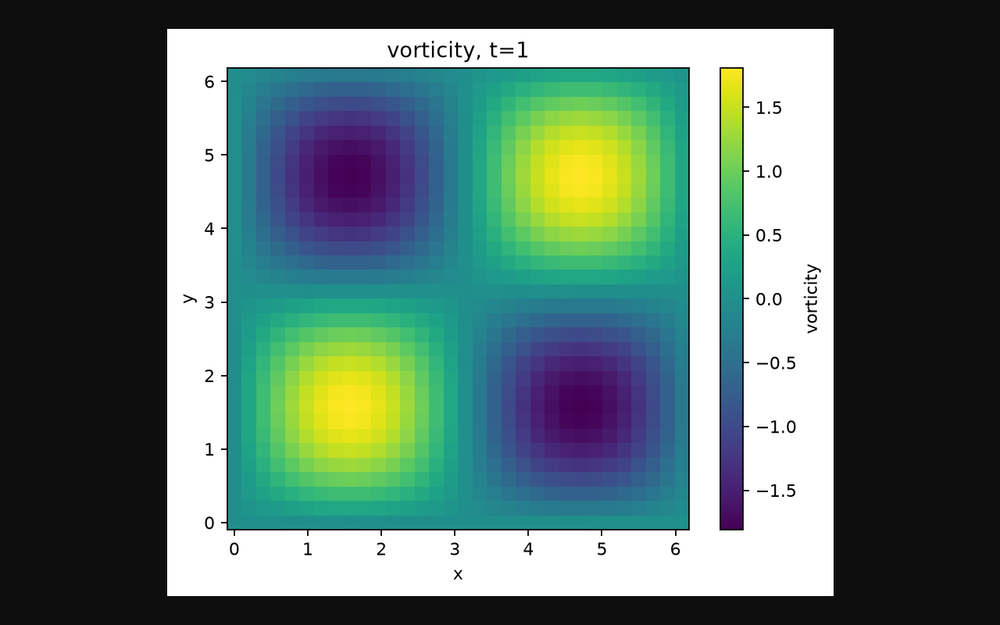

# Recorded installation and demo

```{toctree}
:hidden:

recordings/transcript
```

[Watch the ScreenCLI walkthrough](https://htmlpreview.github.io/?https://github.com/james-coder/navier-stokes-blowup/blob/main/docs/recording.html) or [download the WebM recording](https://github.com/james-coder/navier-stokes-blowup/releases/download/v0.1.0/onboarding.webm).

[](https://htmlpreview.github.io/?https://github.com/james-coder/navier-stokes-blowup/blob/main/docs/recording.html)

The recording shows an actual clean Python 3.12.3 virtual environment, installation of **ns-blowup 0.1.0 from PyPI**, a successful import, JAX 0.11.1 on CPU, a 32×32 Taylor–Green simulation, NPZ/VTK/PNG output, and generation of the offline Observatory. Browser actions demonstrate time, resolution, view modes, animation and JSON download; the downloaded JSON was compared to the generated dataset. This records the named release, rather than claiming that unreleased features were installed from PyPI.

Read the [actual command transcript](recordings/transcript.md), [simulation script](recordings/demo.py), and [version/checksum metadata](recordings/recording.json). On-screen step titles provide captions; the recording has no audio.

The [reproduction script](https://github.com/james-coder/navier-stokes-blowup/blob/main/scripts/recording/record.mjs) uses the exported `launchSession` recording API from [ScreenCLI](https://github.com/usefulagents/screencli), version **0.3.12**, with Playwright **1.59.1**. Deterministic browser actions drive real subprocesses through a loopback-only demo page. This uses ScreenCLI's capture engine locally, without its cloud AI agent or an account. The package-lock file pins the recording dependencies. ScreenCLI's interactive `record` agent requires cloud sign-in or an Anthropic API key; its exported capture API can record this fully specified workflow directly.

From a checkout, install the tools and select a **fresh** work directory with room for a virtual environment, downloads and video:

```bash
npm ci --prefix scripts/recording
cd scripts/recording
npx playwright install --with-deps chromium
cd ../..
node scripts/recording/record.mjs /path/to/fresh-recording-directory 0.1.0
```

The script refuses to reuse an existing directory, runs every displayed command, stops on failure, records the browser, and writes `onboarding.webm`, `transcript.md`, `recording.json`, the generated app, downloaded JSON, simulation data and PNG. Use Python 3.12+ with venv support and Node 22. The recorded versions are historical; inspect the next run's metadata rather than assuming transitive dependencies stay fixed.

**Scope:** CPU onboarding and the component Observatory. This does not validate GPU installation, full construction reproduction or high-resolution CFD. The watch page streams a GitHub release asset; download the video separately for offline viewing.
