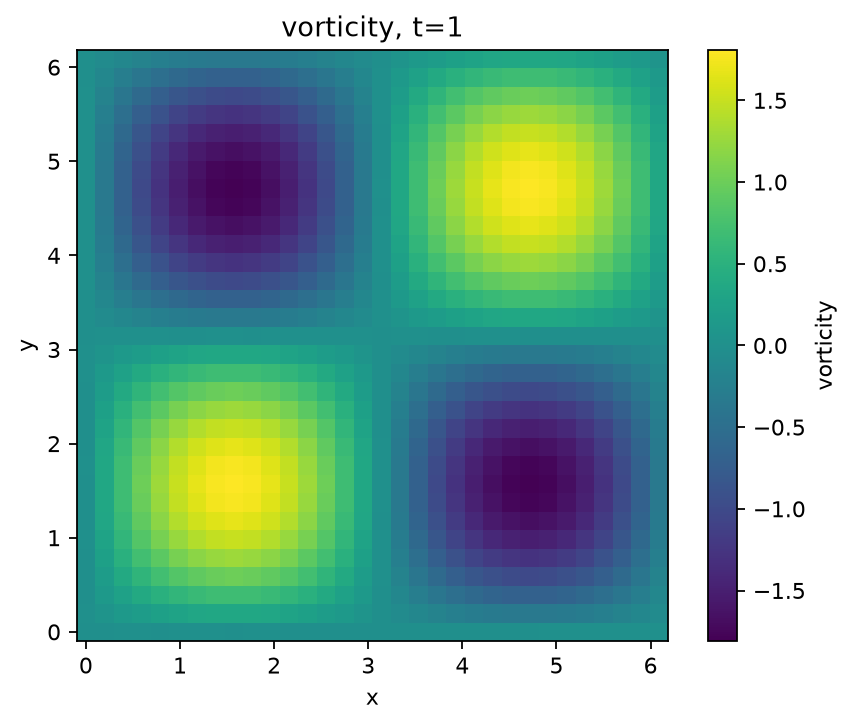

# Getting started

## 1. Explore before installing

Open [the Singularity Observatory in your browser](https://htmlpreview.github.io/?https://github.com/james-coder/navier-stokes-blowup/blob/main/docs/observatory.html). Move the time slider, switch between fixed physical scale and following the core, and change the grid resolution. The labels distinguish coordinate geometry from measured numerical residuals. Inspect the [numerical dataset](observatory.json), or use the app's **Download numerical data (JSON)** button to save it for analysis.

For offline use, [download the app and documentation ZIP](https://github.com/james-coder/navier-stokes-blowup/releases/latest/download/documentation.zip), extract it, and open `observatory.html` from that folder. In a built or downloaded documentation site, you can also [open the bundled app](observatory.html) directly. The downloaded app needs no Python installation or network connection.

## 2. Run a simple flow

Follow the [installation instructions](https://github.com/james-coder/navier-stokes-blowup#install). Then:

```python
from ns_blowup import Simulation

simulation = Simulation((32, 32), nu=0.05, device="cpu")
result = simulation.run("taylor-green", t_end=0.5, frames=11)
print(result.times)
print(result.final.shape)  # (32, 32, 2)
result.plot(path="outputs/first-flow.png")
```

The default box is `[0,2π)` in each direction, with periodic boundaries. The initial velocity is the built-in 2D [Taylor–Green vortex](https://en.wikipedia.org/wiki/Taylor%E2%80%93Green_vortex), a periodic flow whose vortices weaken as viscosity dissipates their energy. Its known exact solution lets us check the simulation’s accuracy. The viscosity controls diffusion. Frame count controls saved output, not the internal timestep. A saved image shows the final speed by default.

For a vorticity plot, use `result.plot(quantity="vorticity", path="outputs/vorticity.png")`. Here is a checked-in example at `t=1.0`, with a 32×32 grid and `nu=0.05`:



[Full-size PNG](images/vorticity.png) · [Script that generated it](https://github.com/james-coder/navier-stokes-blowup/blob/main/examples/render_vorticity.py).

Change the shape to `(24,24,24)` and the initial condition to `"abc"` for a three-dimensional exact flow. Use small shapes while learning; storage and intermediate arrays grow with the product of all grid dimensions.

For a nonlinear 3D flow, use `"taylor-green-3d"` on a 3D grid. See the [3D Taylor–Green example and independent convergence results](taylor-green-3d.md) for its initial condition, Reynolds number, and tested regime.

## 3. Define your own initial condition

```python
import jax.numpy as jnp
from ns_blowup import Simulation

sim = Simulation((32, 32), lengths=(4.0, 3.0), nu=0.02)

def initial(points):
    y = points[..., 1]
    return jnp.stack([jnp.sin(2*jnp.pi*y/3.0), jnp.zeros_like(y)], axis=-1)

result = sim.run(initial, t_end=0.2, frames=5)
```

The callback gets all grid points. Its return shape must be the spatial grid shape followed by the velocity component axis. Initial data are projected and high modes removed; inspect `result.metadata["initial_projection_relative_change"]` to see the relative change.

## 4. Apply a force

```python
import jax.numpy as jnp

def force(points, time):
    y = points[..., 1]
    return jnp.stack([0.1*jnp.cos(time)*jnp.sin(2*jnp.pi*y/3.0),
                      jnp.zeros_like(y)], axis=-1)

result = sim.run(initial, t_end=0.2, forcing=force, frames=5, dt=0.005)
```

Here `dt` is a maximum; the adaptive driver may use smaller steps. Strong forcing can demand additional care even when the initial velocity is small. For a differentiable forcing parameter, follow [the optimization example](https://github.com/james-coder/navier-stokes-blowup/blob/main/examples/optimize_forcing.py), which uses the compiled fixed-step interface.

## 5. Save, reload, and inspect

```python
from ns_blowup import SimulationResult

result.save("outputs/flow.npz")
restored = SimulationResult.load("outputs/flow.npz")
metrics = restored.diagnostics()
print(metrics["energy"])
print(metrics["divergence_max"])
restored.export_vtk("outputs/flow-final.vtk")
```

NPZ carries grid lengths, time samples, viscosity, velocity, schema version, and metadata. Reloading a float64 result requires x64 enabled so it cannot silently lose precision. The export contains velocity samples, not a liquid mesh or a Blender bake cache.

## 6. Choose numerical precision

Run the [quickstart example](https://github.com/james-coder/navier-stokes-blowup/blob/main/examples/quickstart.py) from a checkout with x64 enabled:

```bash
JAX_ENABLE_X64=1 python examples/quickstart.py
```

In your own script also request `Simulation(..., dtype="float64")`. For the CLI use `--precision float64`; the CLI enables x64 before constructing arrays. Library import does not change global numerical settings. Exact benchmark evaluation uses the precision of your JAX arrays and configuration.

## 7. Evaluate construction components

```python
import jax.numpy as jnp
from ns_blowup import SimilarityCoordinates, HeatExterior

mapping = SimilarityCoordinates(h=0.005)
coordinates = mapping(jnp.array([0.01, 0.02, 0.03]), tau=1e-4)
print(coordinates.q, coordinates.eta, coordinates.X)

exterior = HeatExterior(h=0.005, order=96)
print(exterior.azimuthal_velocity(jnp.array([1.0, 2.0]), tau=0.1))
```

`tau` is time remaining, supplied directly. Avoid computing extremely small `tau` by subtracting nearly equal float32 times. The exterior must not be evaluated at radius zero. Increasing quadrature order and comparing residuals is useful; interpreting it as the complete theorem is not supported.

## Troubleshooting

| Symptom | Action |
|---|---|
| GPU unavailable | Confirm `jax.devices()` and install the matching JAX CUDA extra; CPU execution remains available |
| GPU already in use / allocation error | Set `XLA_PYTHON_CLIENT_PREALLOCATE=false`, reduce grid size and saved frames |
| Float64 refused | Set `JAX_ENABLE_X64=1` before starting Python |
| Shape mismatch | Put vector components on the final axis; forcing must return the full grid shape |
| Named flow rejected for box length | Supply a callback with a period matching that box |
| Simulation reaches `max_steps` | Inspect the flow, reduce duration, or raise the explicit step budget |
| NaN from a construction component | Check its mathematical domain and finite inputs |
| Large discretization error | Refine space/time and compare with an independent reference; changing precision alone may not help |
